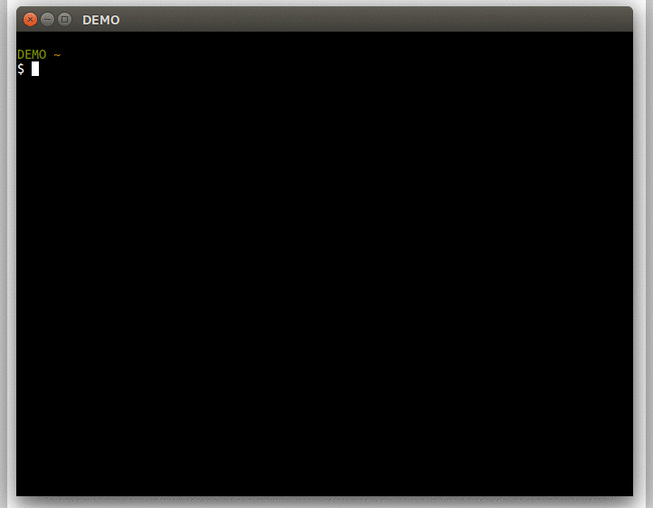

# at-types-search

search d.ts from @types

## Install

```sh
$ npm -g install at-types-search
```

## Usage

```sh
$ @ts
```



## Spec

* Search index file will be saved to `~/.at-types-search/search-index.json`.
* The saved index file will be used as cache until 24 hours have passed.
* Search for types package name(partial match), globals(foward match), modules(foward match).

## API

```js
var atTypesSearch = require('at-types-search');

// single word
atTypesSearch.search('google').then(function (result) {
  ...
});

// multi words (AND)
atTypesSearch.search([ 'react', 'redux' ]).then(function (result) {
  ...
});

// force update cache
atTypesSearch.search('jquery', true).then(function (result) {
  ...
});
```

## License

[MIT](http://www.opensource.org/licenses/mit-license)

&copy; 2017 [ktty1220](mailto:ktty1220@gmail.com)
